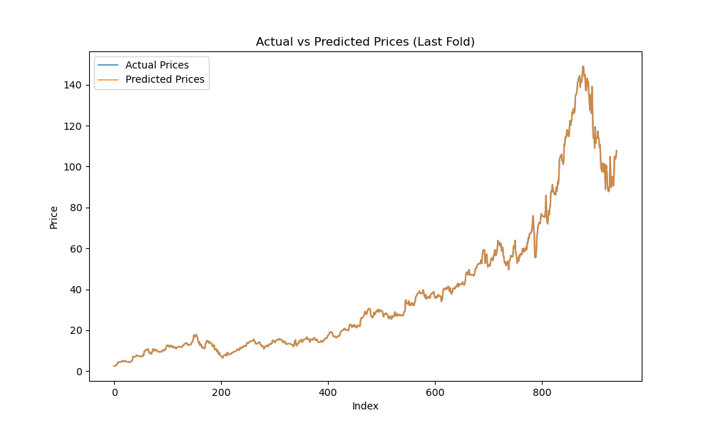
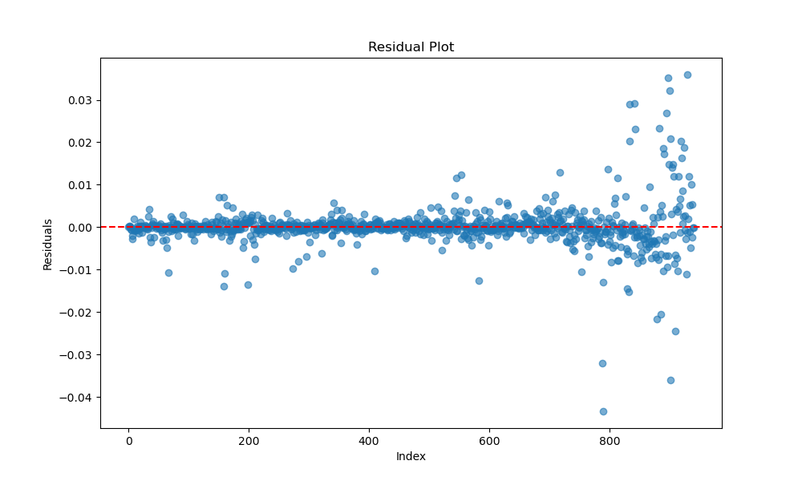
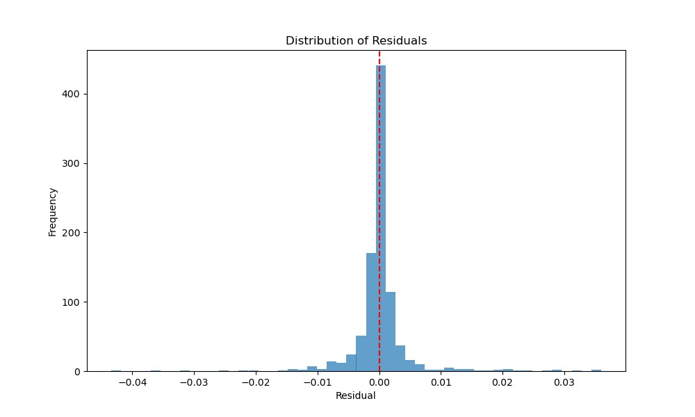
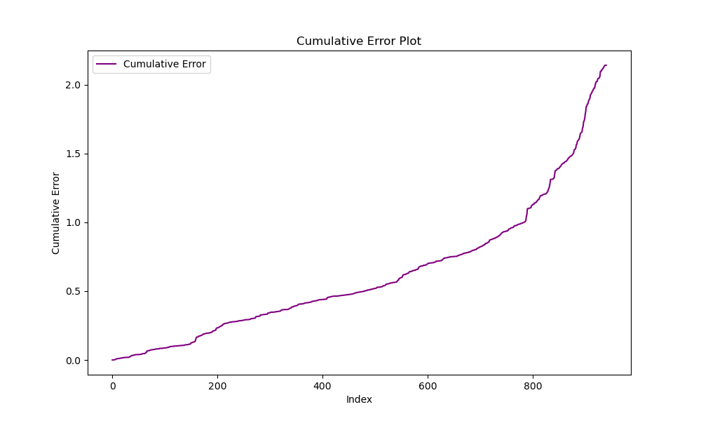

# Stock Price Prediction with Machine Learning

## Overview
This project uses machine learning to predict share prices based on historical market data. Key highlights:
- **Feature Engineering**: Moving averages, volatility, and past prices.
- **Modelling**: Ridge Regression with polynomial features.
- **Performance Evaluation**: Metrics such as MSE and MAE using K-Fold Cross-Validation.

This project shows my skills in:
- Python programming
- Machine learning
- Financial data analysis
- Data visualisation

## Key Features
- **Feature Engineering**: Includes moving averages, lagged price values, and volatility calculations.
- **Modelling**: Uses Ridge Regression with polynomial features to improve predictions.
- **Performance Evaluation**: Uses K-Fold Cross-Validation to measure performance with MSE and MAE.
- **Visualisations**:
  - Actual vs Predicted Prices
  - Residual Plots to analyse errors
  - Error distribution and cumulative error

## Actual vs Predicted Prices

## Residual Plot

## Residual Distribution

## Cumulative Error Plot

## Limitations
- Predictions are based only on past prices and do not include external factors such as news or events.
- The model may not generalise well for highly volatile or illiquid shares.
- Ridge Regression with polynomial features can sometimes overfit small datasets.

## Future Improvements

- Add external data such as financial news or company earnings to improve predictions.
- Try other models such as Random Forest or LSTM for time-series data.
- Use `TimeSeriesSplit` instead of `KFold` to better reflect real future performance.
- Fine-tune model settings with Grid Search or similar optimisation methods.
